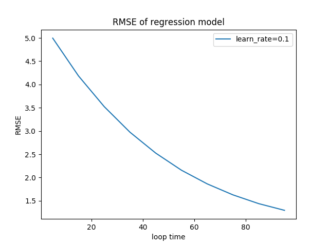
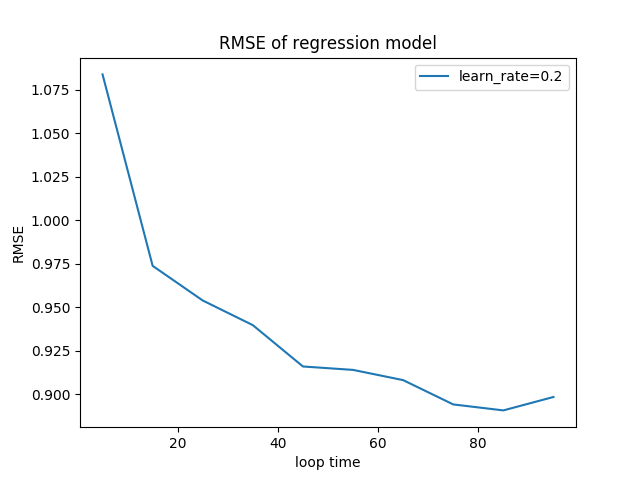
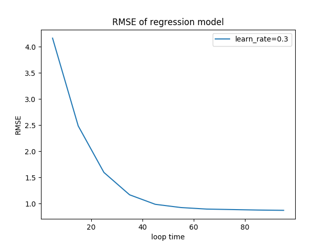
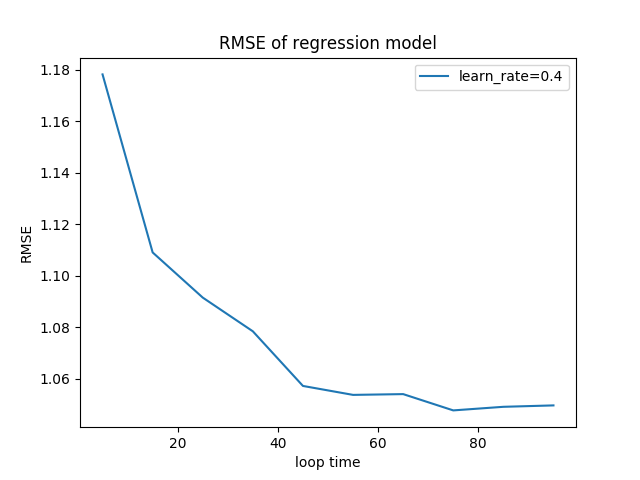
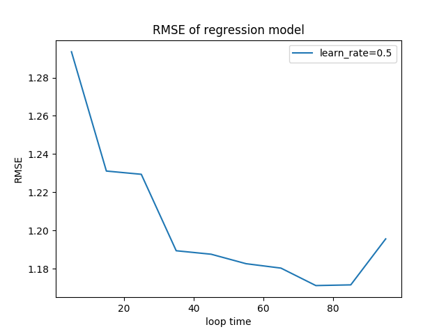
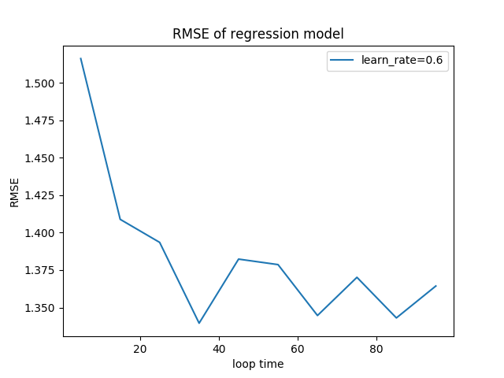

# 第二次作业

- 姓名：艾力亚尔·阿布里米提
- 学号：1711306
- 专业：计算机科学与技术

## 1.问题描述

- 基于数据集 winequality-white 构造线性回归分类器，采用梯度下降或者随机梯度下降均可
- 自行将数据集划分为训练集和测试集，随着迭代次数增加，输出测试集的均方根误差（RMSE），并画出收敛曲线

## 2.解决思路

- 应用线性回归模型算法
- 根据数据特征寻找合适的假设函数 hθ(x)，构造适合的损失函数 J(θ)。求极大似然估计的最大值，或由极大似然可推导出最小二乘函数，求它的最小值。

## 3.算法理论

- 概述: 回归算法是一种有监督学习算法，用来建立自变量 X 和观测变量 Y 之间的映射关系，如果观测变量是离散的，则称其为分类 Classification；如果观测变量是连续的，则称其为回归 Regression。
- 核心思想：回归算法的目的是寻找假设函数 hypothesis 来最好的拟合给定的数据集。常用的回归算法有：线性回归（Linear Regression）、逻辑回归（Logistic Regression）、多项式回归（Polynomial Regression）、岭回归（Ridge Regression）、LASSO 回归（Least Absolute Shrinkage and Selection Operator）、弹性网络（Elastic Net estimators）、逐步回归（Stepwise Regression）等。
- 应用：揭示样本点随着自变量的变化关系，进行预测。
- 优点
  - 建模速度快，不需要很复杂的计算，在数据量大的情况下依然运行速度很快。
  - 可以根据系数给出每个变量的理解和解释
- 缺点
  - 不能很好地拟合非线性数据。所以需要先判断变量之间是否是线性关系。

## 4.算法流程

- 理论或假说的陈述
- 数学模型的设定
- 回归模型(或计量经济学模型)的设定
- 获得数据
- 模型的估计
- 模型的检验
- 预测或预报
- 利用模型做出决策

## 梯度下降法

- 梯度下降的原理： 导数代表了一个函数在某个点的变化率， 向着导数的反方向移动，能够到达函数值更小的点。当导数为零时候来到极值点。
- 假设你在一片浓雾的山中， 你只能感觉到脚下的地面的斜坡。很快到达山谷底部的一个很好的策略就是沿着最陡的斜坡走下坡路。 这正是梯度下降主要思想：它运算测量误差函数的方式是沿着梯度下降的方向计算参数向量 θ 的局部梯度。
- #### 流程
  - 首先对 θ 赋值，这个值可以是随机的，也可以让 θ 是一个全零的向量。
  - 改变 θ 的值，使得 J(θ)按梯度下降的方向进行减少。
  - 梯度方向由 J(θ)对 θ 的偏导数确定，由于求的是极小值，因此梯度方向是偏导数的反方向。
- #### 学习率
  - 梯度下降中的一个重要参数是学习速率（也就是我们通常所说的步长）。
  - 如果学习速率太小，那么算法将需要经过许多迭代才能收敛，这将需要很长时间。
  - 如果学习速率太高，你可能会跳过山谷，最后到达另一边，甚至可能比以前更高。 这可能会使算法发散，数值越来越大，无法找到一个好的解。

## 5.误差评估

- 均方根误差 Root Mean Squared Error（RMSE）：是观测值与真值偏差的平方与观测次数比值的平方根。对一组测量中的特大或特小误差反映非常敏感，所以能够很好地反映出测量的精密度。
- 均方误差 Mean Squared Error（MSE）
- 误差评估函数在机器学习中也称为代价函数（cost function）

## 6.实验数据

- winequality-white

```
	fixed acidity	volatile acidity	citric acid	residual sugar	chlorides	free sulfur dioxide	total sulfur dioxide	density	pH	sulphates	alcohol	quality
0	7.0	0.27	0.36	20.7	0.045	45.0	170.0	1.00100	3.00	0.45	8.8	6
1	6.3	0.30	0.34	1.6	0.049	14.0	132.0	0.99400	3.30	0.49	9.5	6
2	8.1	0.28	0.40	6.9	0.050	30.0	97.0	0.99510	3.26	0.44	10.1	6
3	7.2	0.23	0.32	8.5	0.058	47.0	186.0	0.99560	3.19	0.40	9.9	6
4	7.2	0.23	0.32	8.5	0.058	47.0	186.0	0.99560	3.19	0.40	9.9	6
...	...	...	...	...	...	...	...	...	...	...	...	...
4893	6.2	0.21	0.29	1.6	0.039	24.0	92.0	0.99114	3.27	0.50	11.2	6
4894	6.6	0.32	0.36	8.0	0.047	57.0	168.0	0.99490	3.15	0.46	9.6	5
4895	6.5	0.24	0.19	1.2	0.041	30.0	111.0	0.99254	2.99	0.46	9.4	6
4896	5.5	0.29	0.30	1.1	0.022	20.0	110.0	0.98869	3.34	0.38	12.8	7
4897	6.0	0.21	0.38	0.8	0.020	22.0	98.0	0.98941	3.26	0.32	11.8	6
```

## 实验设计

- ##### 数据读取

  ```
  def load_data(self, file_name):
        '''加载数据'''
        data = pd.read_csv(file_name)
        array = np.array(data.values.astype(float))
        self.x = array[:, :-1]
        self.x = self.normalize(self.x)
        self.y = array[:, -1]
        return array
  ```

- #### 将数据集进行归一化处理

  ```
   def normalize(self, data):
        '''进行归一化处理'''
        data = (data - np.mean(data, axis=0)) / \
            (np.max(data, axis=0) - np.min(data, axis=0))
        return data

  ```

- #### 将数据划分问训练集和测试集（留一法）

  ```
    # 计算一个样本与训练集中所有样本的欧氏距离
    for loop in x_loop:
        for i in range(x.shape[0]):
            # 留一法
            X_test = x[i, :]
            Y_test = y[i]
            X_train = np.delete(x, i, axis=0)
            Y_train = np.delete(y, i)

            alpha, beta = model.train(
                X_train, Y_train,  loop)
            err = Y_test - model.predict(alpha, beta, X_test)
            mean_s_err += err ** 2
        mean_s_err /= x.shape[0]
        mean_s_err_vec.append(np.sqrt(mean_s_err))
  ```

- #### 随机梯度下降

  ```
   def gradient_descent_random(self, x_train, y_train, alpha, beta, learn_rate):
        '''随机梯度下降'''
        randomId = int(np.random.random_sample() * x_train.shape[0])
        x = x_train[randomId, :]
        y = y_train[randomId]
        gradient_arr = np.zeros(x.shape[0])
        gradient_beta = 0
        mean_s_err = 0
        err = y - self.predict(alpha, beta, x)
        mean_s_err += err ** 2

        gradient_arr += err * x
        gradient_beta += err

        # arr 是 alpha vector的梯度vec， alpha0 是 arr[0]
        gradient_arr = gradient_arr * 2
        gradient_beta = gradient_beta * 2
        mean_s_err = mean_s_err

        alpha += np.reshape(gradient_arr, alpha.shape) * learn_rate
        beta += gradient_beta * learn_rate

        return alpha, beta, mean_s_err
  ```

- #### 数据训练
  ```
  def train(self, x_train, y_train, loop_times):
        '''训练模型'''
        # 用随机数据初始化 alpha 和 beta
        alpha = np.random.random_sample(x_train.shape[1])
        beta = np.random.random_sample()
        err_vec = []
        for i in range(loop_times):
            alpha, beta, mean_s_err = self.gradient_descent_random(
                x_train, y_train, alpha, beta, self.learn_rate)
            err_vec.append(mean_s_err)
        return alpha, beta
  ```

## 实验结果

- #### 运行

  ```
  def main():
    learn_rate = input('Input learn_rate: ')
    model = LinearRegression(learn_rate=float(learn_rate))
    file_path = os.path.join(os.path.dirname(
        __file__), 'winequality-white.csv')
    x, y = model.load_data(file_name=file_path)
    mean_s_err_vec = []
    mean_s_err = 0
    x_loop = [i for i in range(5, 100, 10)]  # 迭代次数
    for loop in x_loop:
        for i in range(x.shape[0]):
            # 留一法
            X_test = x[i, :]
            Y_test = y[i]
            X_train = np.delete(x, i, axis=0)
            Y_train = np.delete(y, i)

            alpha, beta = model.train(
                X_train, Y_train,  loop)
            err = Y_test - model.predict(alpha, beta, X_test)
            mean_s_err += err ** 2
        mean_s_err /= x.shape[0]
        mean_s_err_vec.append(np.sqrt(mean_s_err))
    print('loop:', x_loop)
    print('RMSE:', mean_s_err_vec)
    plt.plot(x_loop, mean_s_err_vec, "-", label="learn_rate="+learn_rate)
    plt.xlabel("loop time")
    plt.ylabel("RMSE")
    plt.title("RMSE of regression model")
    plt.legend(loc="best")
    plt.savefig("fig0.2.png")
  ```

- #### 实验结果








- #### 实验结果分析
  - 由结果我们可以知道迭代 60 次之后逐渐收敛
  - 学习率并不是越大越好
  - 当学习率为 0.3 时可以获得较平缓的收敛曲线

## 代码

```
import pandas as pd
import numpy as np
import matplotlib.pyplot as plt
import os


class LinearRegression:

    def __init__(self, learn_rate):
        self.learn_rate = learn_rate

    def load_data(self, file_name):
        '''加载数据'''
        data = pd.read_csv(file_name)
        array = np.array(data.values.astype(float))
        self.x = array[:, :-1]
        self.x = self.normalize(self.x)
        self.y = array[:, -1]
        return self.x, self.y

    def normalize(self, data):
        '''进行归一化处理'''
        data = (data - np.mean(data, axis=0)) / \
            (np.max(data, axis=0) - np.min(data, axis=0))
        return data

    def predict(self, alpha, beta, x):
        arr = alpha * x
        return np.sum(arr) + beta

    def gradient_descent_random(self, x_train, y_train, alpha, beta, learn_rate):
        '''随机梯度下降'''
        randomId = int(np.random.random_sample() * x_train.shape[0])
        x = x_train[randomId, :]
        y = y_train[randomId]
        gradient_arr = np.zeros(x.shape[0])
        gradient_beta = 0
        mean_s_err = 0
        err = y - self.predict(alpha, beta, x)
        mean_s_err += err ** 2

        gradient_arr += err * x
        gradient_beta += err

        # arr 是 alpha vector的梯度vec， alpha0 是 arr[0]
        gradient_arr = gradient_arr * 2
        gradient_beta = gradient_beta * 2
        mean_s_err = mean_s_err

        alpha += np.reshape(gradient_arr, alpha.shape) * learn_rate
        beta += gradient_beta * learn_rate

        return alpha, beta, mean_s_err

    def train(self, x_train, y_train, loop_times):
        '''训练模型'''
        # 用随机数据初始化 alpha 和 beta
        alpha = np.random.random_sample(x_train.shape[1])
        beta = np.random.random_sample()
        err_vec = []
        for i in range(loop_times):
            alpha, beta, mean_s_err = self.gradient_descent_random(
                x_train, y_train, alpha, beta, self.learn_rate)
            err_vec.append(mean_s_err)
        return alpha, beta


def main():
    learn_rate = input('Input learn_rate: ')
    model = LinearRegression(learn_rate=float(learn_rate))
    file_path = os.path.join(os.path.dirname(
        __file__), 'winequality-white.csv')
    x, y = model.load_data(file_name=file_path)
    mean_s_err_vec = []
    mean_s_err = 0
    x_loop = [i for i in range(5, 100, 10)]  # 迭代次数
    for loop in x_loop:
        for i in range(x.shape[0]):
            # 留一法
            X_test = x[i, :]
            Y_test = y[i]
            X_train = np.delete(x, i, axis=0)
            Y_train = np.delete(y, i)

            alpha, beta = model.train(
                X_train, Y_train,  loop)
            err = Y_test - model.predict(alpha, beta, X_test)
            mean_s_err += err ** 2
        mean_s_err /= x.shape[0]
        mean_s_err_vec.append(np.sqrt(mean_s_err))
    print('loop:', x_loop)
    print('RMSE:', mean_s_err_vec)
    plt.plot(x_loop, mean_s_err_vec, "-", label="learn_rate="+learn_rate)
    plt.xlabel("loop time")
    plt.ylabel("RMSE")
    plt.title("RMSE of regression model")
    plt.legend(loc="best")
    plt.savefig("fig0.2.png")


if __name__ == "__main__":
    main()

```
